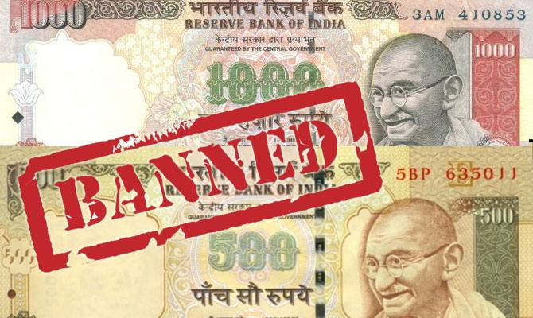
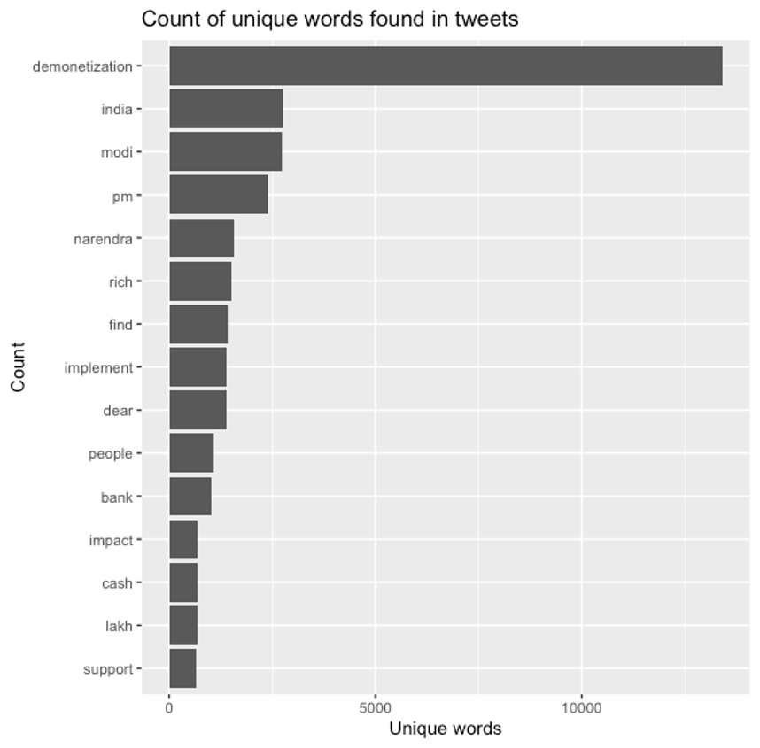
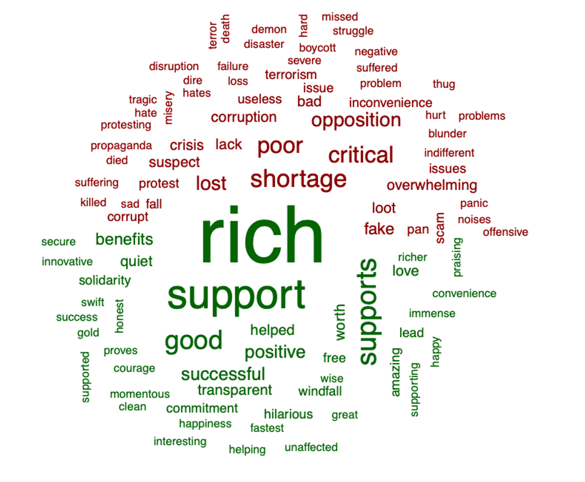
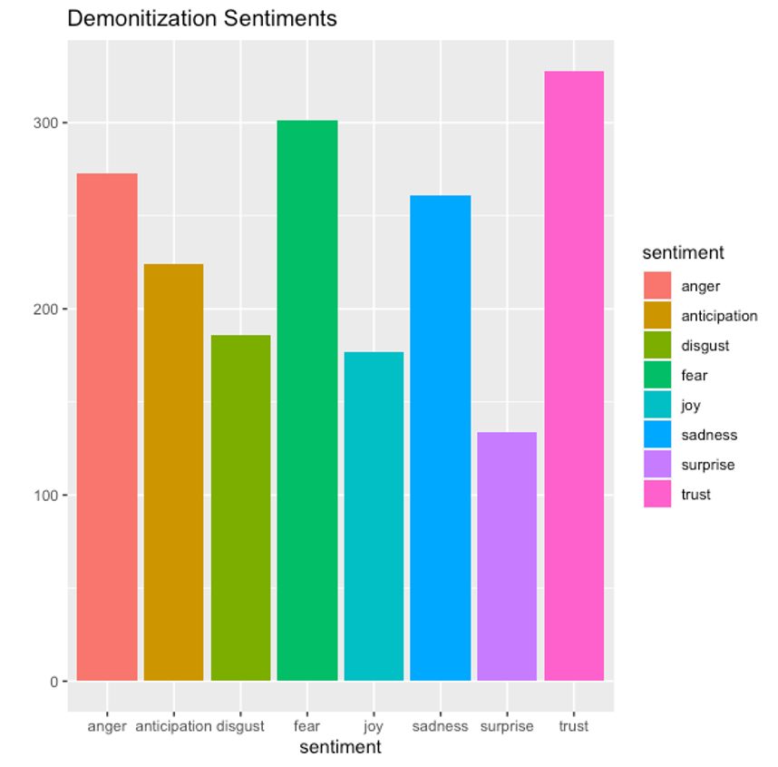
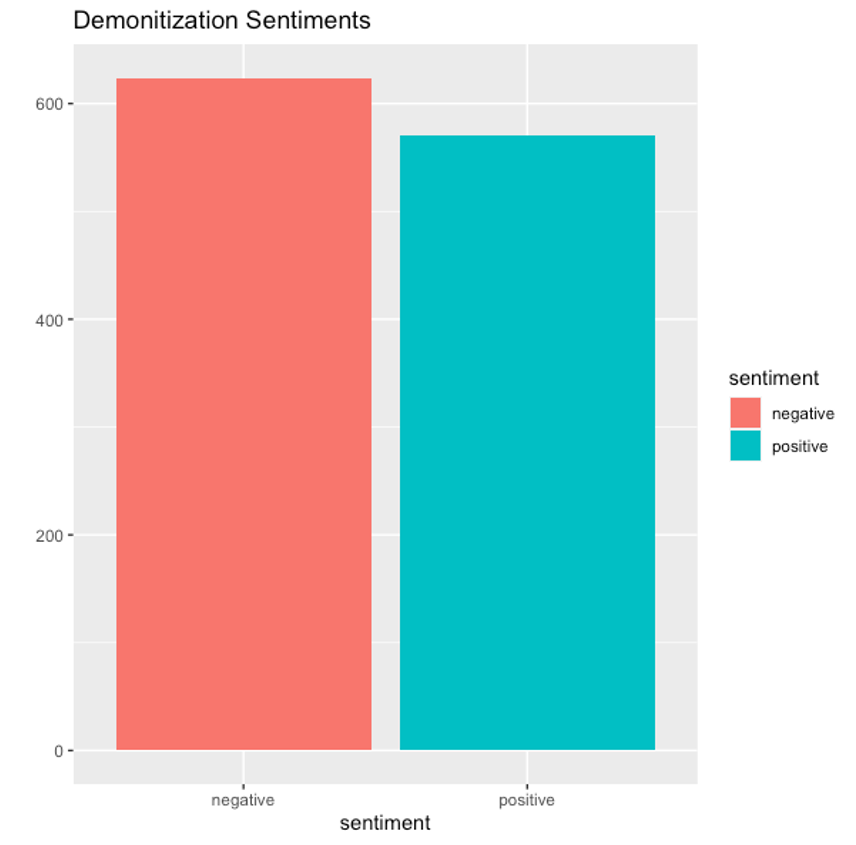

# Sentiment Analysis on Demonetization in India

## Background
The demonetization of ₹500 and ₹1000 banknotes was a step taken by the Government of India on 8 November 2016, ceasing the usage of all ₹500 and ₹1000 banknotes of the Mahatma Gandhi Series as a form of legal tender in India from 9 November 2016.

The announcement was made by the Prime Minister of India Narendra Modi in an unscheduled live televised address to the nation at 20:15 Indian Standard Time (IST) the same day. In the announcement, Modi declared circulation of all ₹500 and ₹1000 banknotes of the Mahatma Gandhi Series as invalid and announced the issuance of new ₹500 and ₹2000 banknotes of the Mahatma Gandhi New Series in exchange for the old banknotes. Ever since then, there have been multiple debates about the decision and effects of it. 

This project aims to understand the sentiments in the population of India right after the announcement was made. 

## Data
The data set was picked up from [Kaggle](https://www.kaggle.com/arathee2/demonetization-in-india-twitter-data).

It contains 14,940 tweets ranging from Nov 8th 2016 to the end of 2017. 

## Data Cleaning
Removed
- Links
- Retweets
- Converted everything to lower case
- Usernames
- Tabs
- Blank spaces before and after the tweets
- Punctuation

Removed stop words after unnesting tweets

## Analysis
### Top 15 words

### Word Cloud

### Results of NRC Lexicon

### Overall Sentiment

